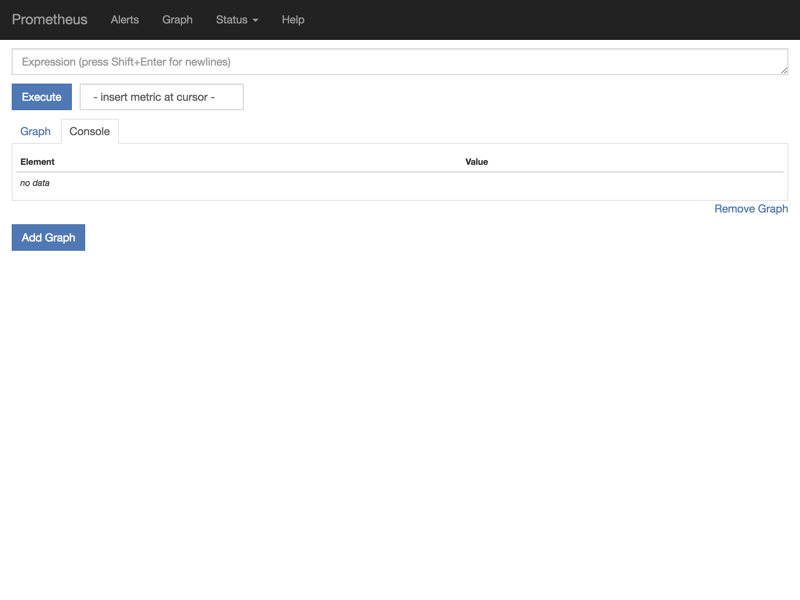
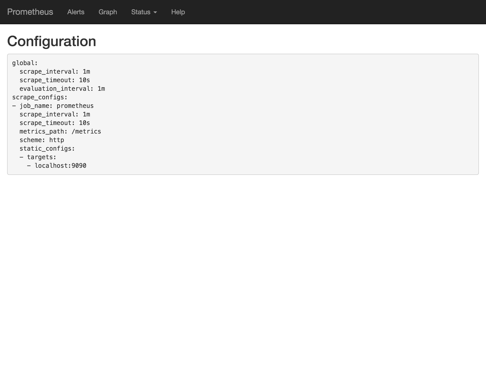
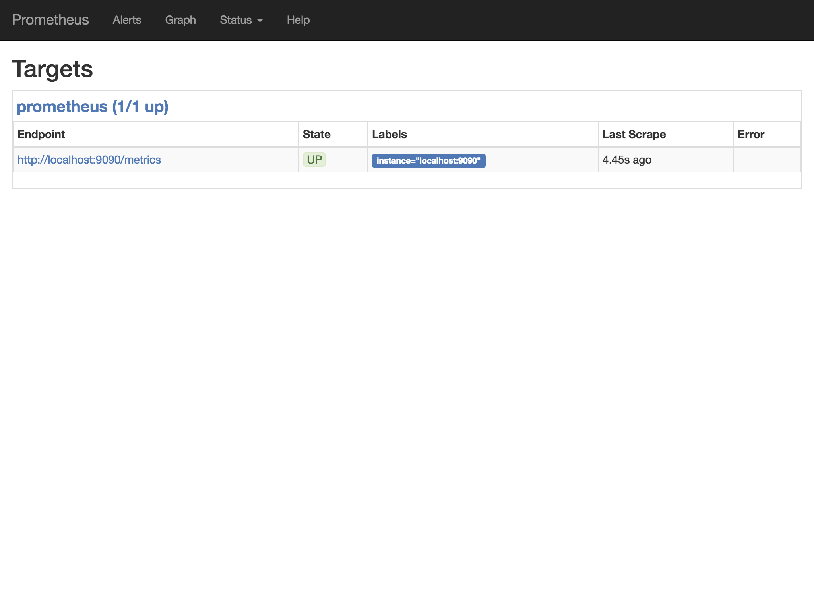

# 1. Getting started

Open a new terminal window, go to this directory and run

```
prometheus
```

You will see something like this:

```
level=info ts=2018-01-08T09:02:06.815824474Z caller=main.go:215 msg="Starting Prometheus" version="(version=2.0.0, branch=non-git, revision=non-git)"
level=info ts=2018-01-08T09:02:06.815920703Z caller=main.go:216 build_context="(go=go1.9.2, user=brew@Sierra-2.local, date=20171111-16:10:49)"
level=info ts=2018-01-08T09:02:06.815949333Z caller=main.go:217 host_details=(darwin)
level=info ts=2018-01-08T09:02:06.818468303Z caller=main.go:314 msg="Starting TSDB"
level=info ts=2018-01-08T09:02:06.818475681Z caller=web.go:380 component=web msg="Start listening for connections" address=0.0.0.0:9091
level=info ts=2018-01-08T09:02:06.818487984Z caller=targetmanager.go:71 component="target manager" msg="Starting target manager..."
level=info ts=2018-01-08T09:02:06.828397549Z caller=main.go:326 msg="TSDB started"
level=info ts=2018-01-08T09:02:06.828457152Z caller=main.go:394 msg="Loading configuration file" filename=prometheus.yml
level=info ts=2018-01-08T09:02:06.828600133Z caller=main.go:371 msg="Server is ready to receive requests."
```

Prometheus automatically looks for a configuration file `prometheus.yml` in the current directory and create a `data` directory there with its time series database.

If your config file has a different name or location, run Prometheus with the `--config.file=<filename>` instead.

Open up your browser at `http://localhost:9090` for the Prometheus web interface:



This is the main page where we can query information from the time series database in the next chapters.


> ### What Prometheus doesn't include
>
> The Prometheus team focuses on what's most important: Providing a highly performant and reliable way for metrics collection. So they avoid bundling stuff  that has been already solved for ages by other tools or which highly depends on your specific environment:
>
> - No fancy interface (we'll come to that in [chapter 6](../06-dashboards/))
> - No HTTPS for the web interface (use a reverse proxy like HAProxy, nginx, etc.)
> - No authentication/authorization (use OAuth, LDAP, etc.)


For now, let's head to _Status > Configuration_. This is the most basic config (and some defaults) we've just loaded:



Prometheus will check each target every minute for new data (`scrape_interval`).

For a better target overview, go to _Status > Targets_:



So there is one target called 'prometheus', the data is scraped from `http://localhost:9090/metrics`, successfully last time 4.45 seconds ago. The simple metric `up` is a quick indicator to check if a scraping target is available.

I encourage you to look at the raw metrics format exposed at the URL above, because that's really the cool thing about Prometheus: **Every system or application** which can expose a website with this plain text metric format can be processed by Prometheus, **no matter which programming language is used** to produce the result.

There is already a long list of [exporters](https://prometheus.io/docs/instrumenting/exporters/) available for a wide variety of systems. Also [client libraries](https://prometheus.io/docs/instrumenting/clientlibs/) for over 15 popular programming languages (and you can even write your own).


## Metric types

There are four types of metrics Prometheus supports:

- **Counter**: A simple numeric value that only goes up
- **Gauge**: Like a counter, but can go up and down
- **Histogram**: Observations (usually things like request durations or response sizes) counted in configurable buckets
- **Summary**: Similar to a Histogram, but calculates configurable quantiles


## What a metric looks like

Let's take the basic `up` metric we've already seen above in more detail:

```

metric name                                      value
↓                                                ↓
up{instance="localhost:9090",job="prometheus"}	 1
   ↑
   labels
```

In the following parts, we will use a mixture of metric names, labels and functions to retrieve information from Prometheus.


