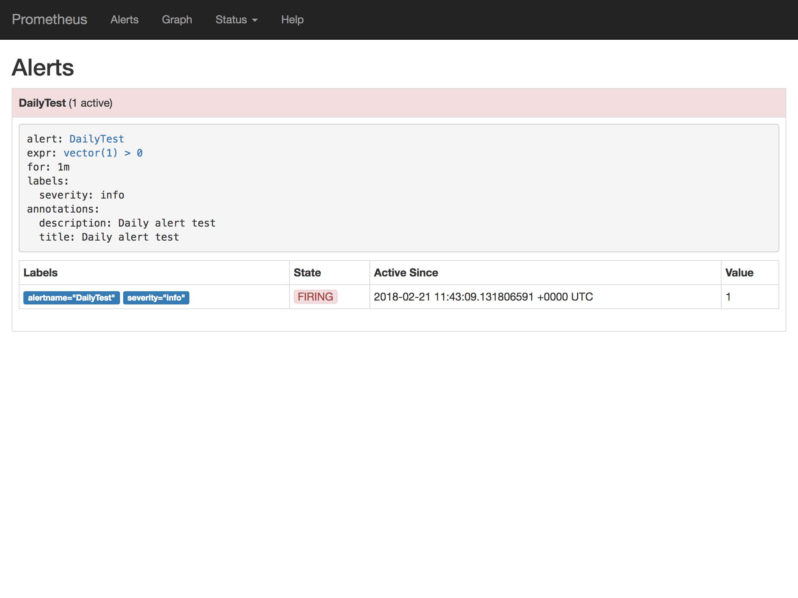

# 5. Alerting

## Defining alerts

Any PromQL query can be turned into an alert, which are defined in  separate rule files in Prometheus. The structure is quite simple:

```yaml
groups:
- name:    # Group name for related alerts
  rules:
  - alert: # Alert name
    expr:  # PromQL expression
    for:   # How long should the expression be true before triggering the alert (e.g. '1m')
    labels:
    annotations:
```

Labels give alerts a context, like:

- the machine or data center the error occurred in
- the severity (critical, warning, …)
- the application tier or service

Annotations are more of a human readable description of the error, e.g.:

- a subject
- a short readable description of the alert
- links to monitoring dashboards or runbooks, helping a person to resolve the issue

For example the [SAP CCloud](https://github.com/sapcc/helm-charts/blob/master/system/kube-monitoring/charts/prometheus-frontend/README.md) project offers some good advice on structuring alerts and meta data.

Once an alert is triggered, it shows up in the Prometheus web interface:




## Sending alerts

While the Prometheus configuration is the place to define alerts, the  Alertmanager takes care of deduplication and sending of the events.

You can group multiple triggered alerts into one event which gets submitted, or you can suppress lower ranking alerts in critical issues. For example, if a machine goes down completely, you want to be alerted about that, not about every single service running on it being unreachable as well.

Alerts can be sent to different receivers like email, PagerDuty, HipChat, Slack and more. If your application of choice isn't covered, alerts can also be pushed via webhook. For example, there are already integrations for JIRA, Microsoft Teams, SMS or Telegram.


## Sending alerts to a webhook

For this tutorial, I created a tiny Node.js script which will just dump the payload received by the webhook. Open your Terminal and run:

```
node webhook-dump.js
```

This will start a HTTP server listening on port 4000.

Next, start Prometheus in a different terminal window:

```
prometheus
```

Finally, start the Prometheus Alertmanager with the webhook config:

```
alertmanager --config.file="alertmanager-webhook.yml"
```

And the alert is logged by our Node.js script:

```
POST:
{ receiver: 'webhook',
  status: 'firing',
  alerts:
   [ { status: 'firing',
       labels: { alertname: 'DailyTest', severity: 'info' },
       annotations: { description: 'Daily alert test', title: 'Daily alert test' },
       startsAt: '2018-02-21T12:44:09.135706466+01:00',
       endsAt: '0001-01-01T00:00:00Z',
       generatorURL: 'http://ares:9191/graph?g0.expr=vector%281%29+%3E+0&g0.tab=1' } ],
  groupLabels: { alertname: 'DailyTest' },
  commonLabels: { alertname: 'DailyTest', severity: 'info' },
  commonAnnotations: { description: 'Daily alert test', title: 'Daily alert test' },
  externalURL: 'http://ares:9093',
  version: '4',
  groupKey: '{}:{alertname="DailyTest"}' }
```


## Sending email alerts

Let's start by running a local SMTP server to handle emails:
 
```
mailslurper
```

The web interface is available at `http://localhost:8080`. Again, start Prometheus and the Alertmanager in separate Terminal windows, this time with the email setup:

```
alertmanager --config.file="alertmanager-email.yml"
```

Now check the MailSlurper web interface for incoming mails.
